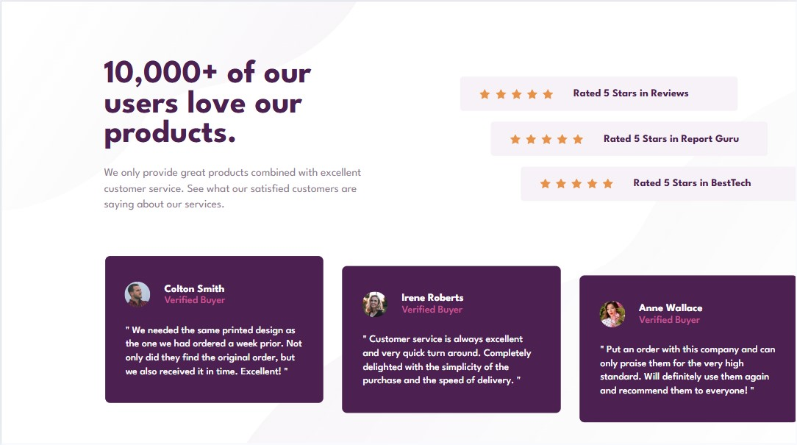
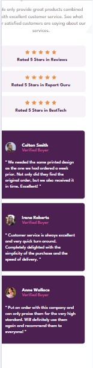

# Frontend Mentor - Social proof section solution

This is a solution to the [Social proof section challenge on Frontend Mentor](https://www.frontendmentor.io/challenges/social-proof-section-6e0qTv_bA). Frontend Mentor challenges help you improve your coding skills by building realistic projects. 

## Table of contents

- [Overview](#overview)
  - [The challenge](#the-challenge)
  - [Screenshot](#screenshot)
  - [Links](#links)
- [My process](#my-process)
  - [Built with](#built-with)
  - [Useful resources](#useful-resources)
- [Author](#author)

## Overview

### The challenge

Users should be able to:

- View the optimal layout for the section depending on their device's screen size

### Screenshot

#### Desktop View

#### Mobile View

### Links

- Solution URL: [Solutions URL](https://github.com/AnthonyCampana/social-proof-section-master)
- Live Site URL: [Live Site URL](https://anthonycampana.github.io/social-proof-section-master/)

## My process

### Built with

- Semantic HTML5 markup
- CSS custom properties
- Flexbox
- CSS Grid
- Mobile-first workflow

### Useful resources

- [Mozilla Documentation](https://developer.mozilla.org/en-US/docs/Learn_web_development) - This helped me to figure out what css properties I need to replicate the designs provided. 

## Author

- Website - [Anthony C](https://anthonycampana.pythonanywhere.com/)
- Frontend Mentor - [@AnthonyCampana](https://www.frontendmentor.io/profile/AnthonyCampana)

